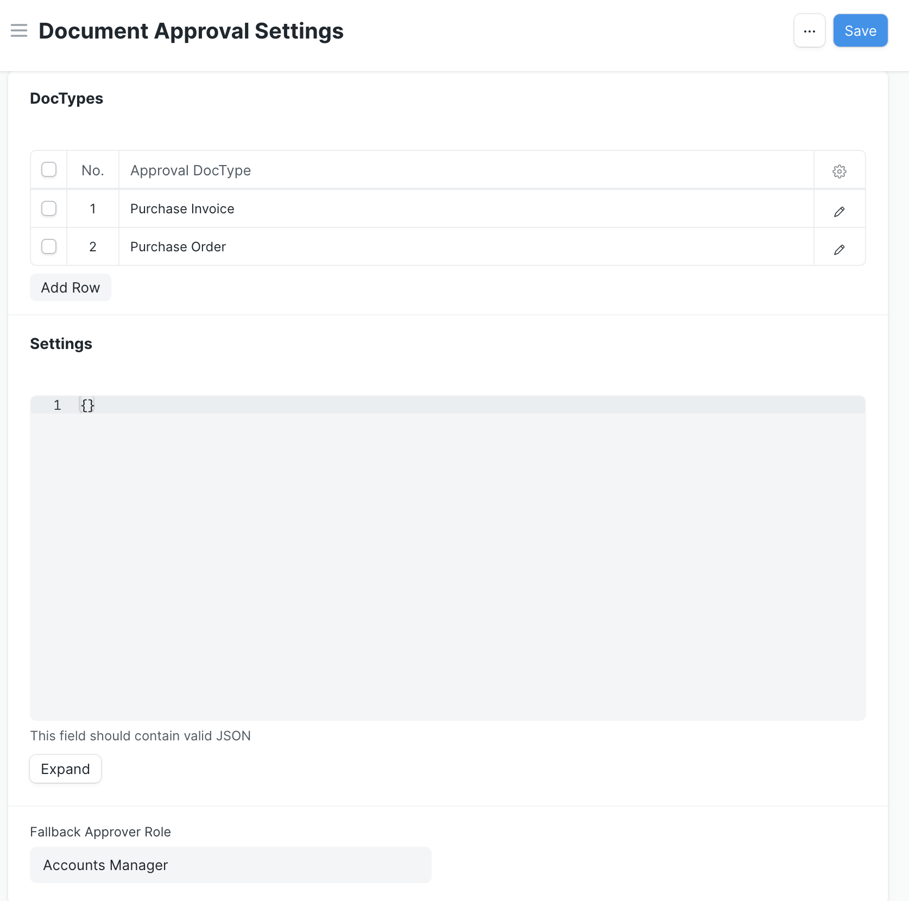
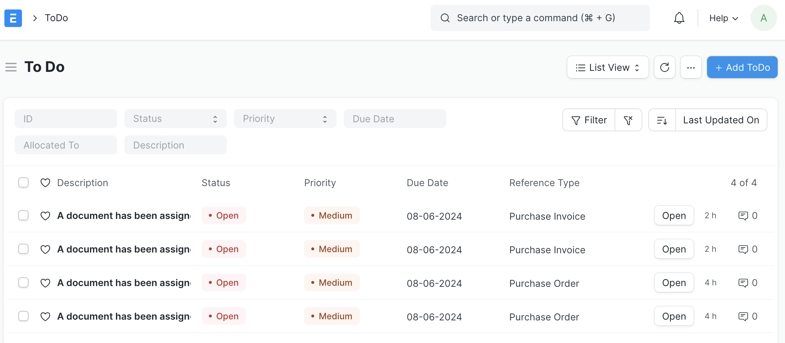
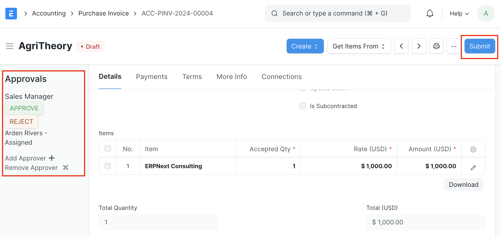
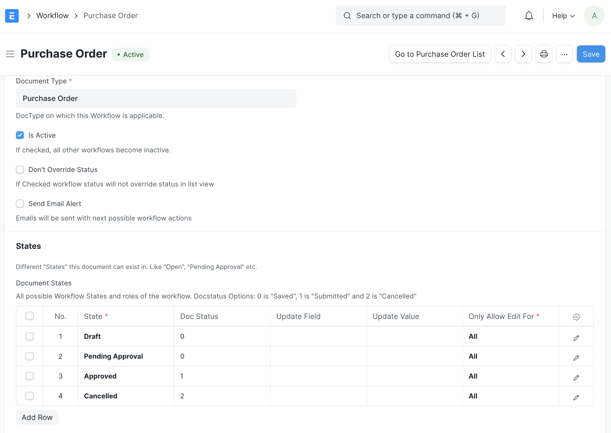
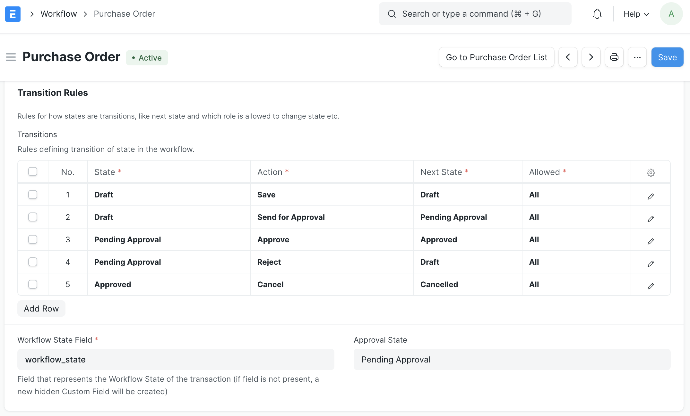
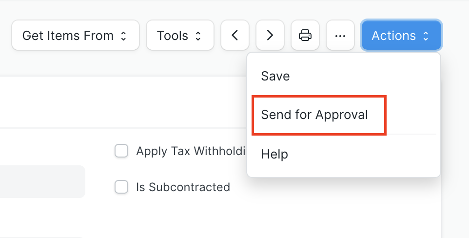

<!-- Copyright (c) 2024, AgriTheory and contributors
For license information, please see license.txt-->

# Approvals

_Approvals_ is an ERPNext application to configure any document type to require the approval of specified Roles or Users. It also integrates with custom workflows.

## Design
This application has a few design opinions that effect how it is used:
 - People change, but Roles tend to be more static (Roles don't usually go on vacation or retire). Hence Document Approval Rules require an Approval Role to be associated with it. That said, the Document Approval Rule may specify a User as the Primary Assignee
 - If a Document Approval Rule computes that a Role's approval is required, it is not subject to hierarchy. The same person with multiple Roles can be asked to approve the same document in different capacities
 - If a DocType has any rule, then at least one approval will be required to approve it. Since this is typically the same as "Submitting" the document, it's an efficient mechanism to apply organizational policy
 - For a document to change into its approved state, all computed approvals and requested User Approvals are required. When the last approver approves the document, it will transition
 - When a document is rejected, a reason for rejection is required. All previous approvals are revoked

## Application DocTypes
The Document Approval Settings document is where a user defines the DocTypes that require approval, creates any global variables that may be used in Document Approval Rules, and assigns a global Fallback Approver Role. The person with the Fallback Approver Role should either be a final decision maker or the one who's responsible for maintaining these rules so they can modify them to appropriately match policy.



The Document Approval Rule is where a user configures an approval requirement on a per-DocType and per-Role basis. The Condition field expects a Python expression that evaluates to a Boolean value, which is typically `True` or `False`, or `1` or `0`. Values like `$ 2.40`, `-50000`, `Chelsea Fruit Company` all evaluate to True, which may not be the author's intention.

The example has an expression that checks if the `grand_total` field in `doc` (in this case, any Purchase Order) is greater than 1,000.00. If it is, the expression evaluates to True and the given document will require an approval from the Accounts Manager Role.

The Primary Assignee and Primary Rejection User fields allow for a specific User


The User Document Approval tracks the cases where a specific person is being asked to approve a Document. Any user who can view a document with a configured Document Approval Rule can request a User Approval or remove it.

The application also integrates with existing ERPNext functionality. When a specific user gets assigned a document to approve, the system automatically creates a ToDo for them. The user may also define a custom Workflow for any DocType with a Document Approval Rule to lay out the different approval states and transitions - refer to the Purchase Order (with custom Workflow) section for an example.



## Example Usage

| Doctype | Role | Logic | Primary Approver | 
| --- | --- | --- | --- |
| Purchase Invoice | None | 200 or less |  |
| Purchase Invoice | Stock Manager  | `200.00 < doc.grand_total <= 500.00` | mmckay@cfc.co |
| Purchase Invoice | Sales Manager | `500.00 < doc.grand_total <= 1000.00` | arivers@cfc.co |
| Purchase Invoice | Accounts Manager | `doc.grand_total > 1000` | mbritt@cfc.co |
| | | | |
| Purchase Order | None | 200 or less |  |
| Purchase Order | Stock Manager  | `200.00 < doc.grand_total <= 500.00` | mmckay@cfc.co |
| Purchase Order | Sales Manager | `500.00 < doc.grand_total <= 1000.00` | arivers@cfc.co |
| Purchase Order | Accounts Manager | `doc.grand_total > 1000` | mbritt@cfc.co |
| | | | |
| Customer | Sales Manager | `any([c.credit_limit != frappe.get_value('Customer Credit Limit', c.name, 'credit_limit') for c in doc.credit_limits])` | arivers@cfc.co |

### Purchase Invoice
In this example configuration, there are three Document Approval Rules set up on the Purchase Invoice DocType. Purchase Invoices with a Grand Total of 200 or less don't require approval. Ones with a Grand Total greater than 200 but less than or equal to 500 require approval from the Stock Manager and Primary Assignee User mmckay@cfc.co. Purchase Invoices with a Grand Total greater than 500 but less than or equal to 1,000 require approval from then Sales Manager and Primary Assignee User arivers@cfc.co. And any Purchase Invoice with a Grand Total greater than 1,000 requires approval from the Accounts Manager and Primary Assignee User mbritt@cfc.co.

The screen shot shows the Approvals section in the sidebar of a Purchase Invoice, which is where the Role and Primary Assignee have the option to Approve or Reject this document. There's also the possibility to add or remove approvers here. Since the document has a Grand Total of $1,000.00, it triggered the Document Approval Rule for the Sales Manager (the Grand Total is more than 500 but equal to 1000) and is assigned to Arden Rivers (arivers@cfc.co).

The document is a Draft and hasn't been approved yet, but a User still sees the Submit button. For cases where a User shouldn't be able to Submit a document until approvals are done, then there should be a custom Workflow in place.



### Purchase Order (with custom Workflow)
The configuration for Document Approval Rules set up for the Purchase Order DocType is identical to the Purchase Invoice example. However, in this case, there's also a custom Workflow for Purchase Orders that defines the states and transitions relating to the approval process.

First, a new Workflow for the Purchase Order DocType is created. It's active and declares four States for the document, which are Draft, Pending Approval, Approved, and Cancelled.



The Workflow also defines the Transition Rules as follows:

| State | Action | Next State | Allowed |
| --- | --- | --- | --- |
| Draft | Save | Draft | All |
| Draft | Send for Approval | Pending Approval | All |
| Pending Approval | Approve | Approved | All |
| Pending Approval | Reject | Draft | All |
| Approved | Cancel | Cancelled | All |



When a Purchase Order triggers a Document Approval Rule, instead of a Submit button, the User viewing the document will see an Actions dropdown with available choices, depending on the Workflow state.



In this example, the User selected Send for Approval for the Purchase Order, so the new status shows as "Pending Approval" and the Approvals section in the sidebar has the assignments.


### Non-submittable DocTypes
This exampled is based on company policy where a Sales Manager must approve changes to a Customer's credit limit. This script detects


## Additional configuration and improving user experience

Use a custom script to make a form read-only when it is in its "Pending Approval" state. This can only be achieved when a custom Workflow is used.

```javascript


```


