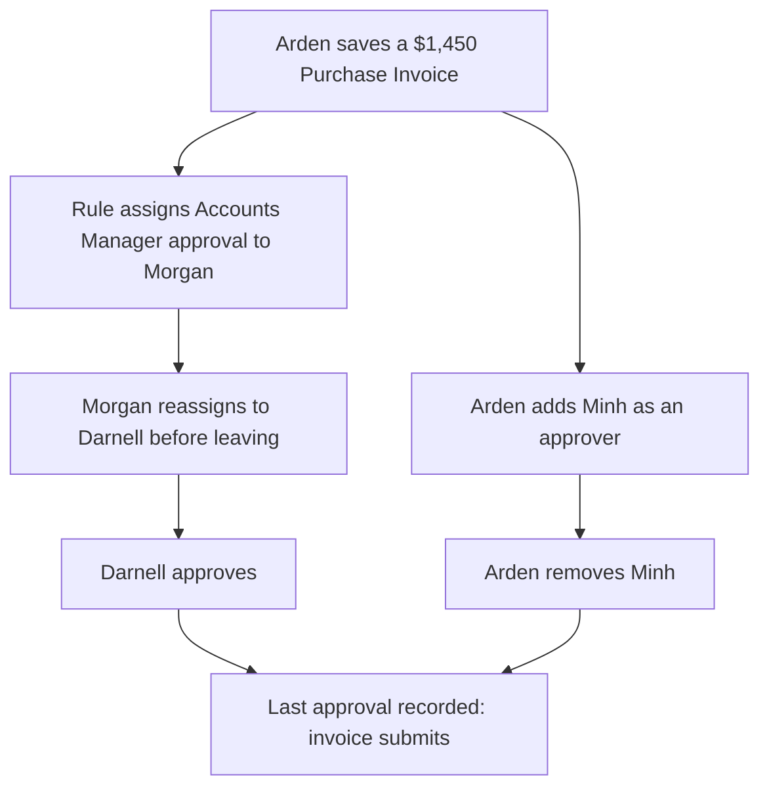

<!-- Copyright (c) 2026, AgriTheory and contributors
For license information, please see license.txt-->

# Usage

  Rohan Bansal, Cursor, fproldan, Ishwarya, Myuddin Khatri, Heather Kusmierz, and Tyler Matteson 2026-10-04

Approval work happens in one place: the Pending Approvals drawer. The drawer lists every document waiting on the current user. When a document is open, the drawer also shows every approval that document requires, who each one is assigned to, and what the current user can do about it.

## Finding Approval Work

When a user saves a document that matches a Document Approval Rule, the app assigns the approval to someone with the rule's role. That person learns about it in several ways:

- A ToDo appears in their ToDo list
- A notification appears in the desk notification menu
- The Pending Approvals icon in the desk navbar shows a count of open approvals
- If the site sends reminder emails, a daily email lists everything waiting

Each notification and reminder email links directly to the document with the drawer already open and the matching item highlighted. The extra link parameters are removed from the address bar once the drawer opens, so a bookmark or a page refresh does not reopen it.

## The Pending Approvals Drawer

Click the Pending Approvals icon in the navbar to open the drawer, or press Ctrl+Shift+X (⌘+Shift+X on macOS) from anywhere in the desk except a text field. The same shortcut closes it.

The drawer pushes the page to the left instead of covering it, so the form and its buttons stay visible beside the drawer. The drawer stays open while a user works in the form or in a dialog. It closes from its close button, the navbar icon, or the shortcut.

The drawer has up to two sections.

| Section | When it appears | What it shows |
| :--- | :--- | :--- |
| The open document (titled with the document type and name) | A form is open and its DocType has at least one enabled Document Approval Rule | Every approval the document requires, with the actions the current user can take |
| Assigned to you | The current user has open approvals on other documents | A queue of those documents, newest first |

Each item in the Assigned to you queue shows the document type and name, the role being asked for (or "User Approval" for a person added to that one document), and how long it has been waiting. Click Review to open the document. If the document has an attachment, such as a scanned supplier invoice, the drawer opens the first attachment in a preview at the same time.

When there is nothing left to review, the drawer reads "All caught up."

### Reading an Approval Row

Each approval on the open document has its own row. A row shows:

- Role: the role the rule requires, or "User Approval" when a specific person was added to this document
- Assigned to: the person currently responsible, "You" when it is the current user, or "Unassigned"
- Rule, Requested by, or Source and Reason: which User rule or integration created the row, who added a person manually, or which provider ran; plus optional reason (User Approval rows)
- Approved by: who approved it, once someone has

The buttons under a row depend on the row type and the current user. The following sections explain each one.

## Approving a Document

Review the document, then click Approve on the row that belongs to the current user.

Approve appears only while approvals are active on the document. Without a Workflow, approvals are active while the document is a draft. With a Workflow, they are active while the document is in the workflow's approval state, and the form is read-only during that time. Approve also requires the current user to be the right person for that row:

- On a rule row that is assigned to someone, only the assignee can approve (Administrator can always approve)
- On a rule row with no assignee, anyone with the rule's role can approve
- On a User Approval row, only the named person can approve

The approval is recorded immediately and appears on the document timeline. If other approvals are still outstanding, the document stays where it is. When the last required approval is recorded, the app finishes the document:

- A submittable document with a Workflow takes the workflow's approval action (usually Approve), which submits it
- A document that is never submitted moves to the workflow state marked as its approved state
- A submittable document without a Workflow submits directly

On a submittable document without a Workflow, the drawer asks the approver to confirm with the standard "Permanently Submit" prompt before recording the approval. Dismissing the prompt records nothing. The document submits only once the last required approval is in.

The standard Submit button stays blocked until every required approval has been recorded.

## Rejecting a Document

When something about the document needs to change, click Reject. If the Workflow requires a rejection reason, the drawer asks for one. The reason is added to the document timeline so the person who created the document knows what to fix.

Rejecting always clears the approvals already recorded on the document. Everyone approves again after the document is corrected. With a Workflow, Reject also applies the workflow's Reject action, which usually returns the document to Draft. Without a Workflow, the document's status does not change. The person who created the document should edit it and save it again.

## Working with Approvers on a Single Document

Rules decide who approves documents in general. Sometimes a single document needs something different. A user might need a colleague to look at one invoice, or a manager might be out of the office when an approval lands on them. The drawer handles these cases on the open document without changing any rules.

There are two kinds of rows, and each supports different actions.

| Row | Created by | Approve | Reassign | Remove |
| :--- | :--- | :--- | :--- | :--- |
| Rule row (shows a role, such as Accounts Manager) | A matching Document Approval Rule (Role type) | The assignee, or anyone with the role if unassigned | Yes | No |
| User Approval row from a User rule | A User-type Document Approval Rule | Only that person | Only if the rule has an Approval Role: the assignee if they hold it, or a User Approval Manager | No |
| User Approval row from a provider | An integration hook | Only that person | No | No |
| User Approval row added in the drawer | Add approver | Only that person | No | Yes (requester or User Approval Manager) |

A rule row cannot be removed because the rule still applies to the document. A User Approval row from a rule or provider also cannot be removed; the app syncs it from the rule expression or provider. To drop that requirement, change the rule, the document so the rule no longer applies, or disable the rule. Manual User Approval rows cannot be reassigned; remove the row and add someone else. A User rule's rows can be reassigned within the rule's Approval Role, as described in [Configuration](configuration.md#approving-by-a-person-on-the-document).

### Adding an Approver

Click Add approver at the bottom of the open document's approvals. Choose a user, optionally enter a reason, and confirm.

Any user who can open the document can add an approver while approvals are active on it. Owning the document or having write permission on it is not required. Users with the User Approval Manager Role (System Manager unless an administrator changes it in Document Approval Settings) can add an approver at any time. A person can only be added once to the same document.

The added person becomes an additional required approval. The document does not finish until they approve, along with every rule row. The app shares the document with them if they could not already open it. It also creates a ToDo for them and sends them a notification. The addition, with its reason, is recorded on the document timeline.

### Reassigning an Approval

Click Reassign on a rule row to hand that approval to someone else. Choose a user and optionally enter a reason. The user list shows only active desk users who hold the rule's role. For a User rule, that is the rule's Approval Role. The reason becomes the description on the new person's ToDo.

Reassign appears when the row has not been approved yet and approvals are active. It appears only to the person currently assigned or to a user with the User Approval Manager Role. On a User rule's row, the assignee must also hold the rule's Approval Role, and the button never appears if the rule has none. You cannot reassign to someone who already has an approval row on the document.

The app closes the previous person's ToDo, creates a ToDo for the new person, and shares the document with them if needed. Both people receive a notification, and the change is recorded on the timeline. From then on, only the new assignee (or Administrator) can approve that row. The rule requirement itself does not change.

### Removing an Approver

Click Remove on a User Approval row and confirm.

Remove appears to the person who added that approver and to users with the User Approval Manager Role. When an integration added the approver, only the User Approval Manager Role can remove them.

The removed approver and the person who added them each receive a notification unless they made the change themselves. The removal is recorded on the document timeline.

### Example: One Invoice, Three Changes

Chelsea Fruit Co requires Accounts Manager approval on every Purchase Invoice over $1,000, and the rule assigns those approvals to Morgan Britt.

Arden Rivers, who manages the warehouse, enters a $1,450 invoice from a produce supplier and saves it. The rule matches, and Morgan receives a ToDo and a notification. Part of the shipment was produce for a sales promotion, so Arden opens the drawer, clicks Add approver, and adds Minh McKay with the reason "Confirm promotional pricing." Minh now has her own User Approval row on the invoice.

Morgan is leaving for a week of vacation. She opens the invoice, clicks Reassign on the Accounts Manager row, and picks Darnell Benton, who also holds the Accounts Manager role. Morgan's ToDo closes and Darnell receives a new one. Darnell reviews the invoice and approves the Accounts Manager row.

Meanwhile, the supplier confirms the promotional pricing by email, so Minh's review is no longer needed. Arden added Minh, so Arden can remove her. Arden clicks Remove on Minh's row. With the Accounts Manager approval in place and no other approvals outstanding, the invoice submits.

The timeline on the invoice records each step: who was added and why, who reassigned the approval and to whom, who approved, and who was removed.

## How Assignment Works

When a document is saved, the app checks every enabled rule for that DocType. With a Workflow, it only assigns approvals while the document is in the workflow's approval state.

If a rule has a Primary Assignee, that user receives every assignment from the rule. Otherwise, the app rotates through the users who hold the role so the work spreads evenly over time.

If a rule has Automatically Assign Users turned off, the approval is still required but nobody receives a ToDo. Any user with the role can approve it from the drawer.
