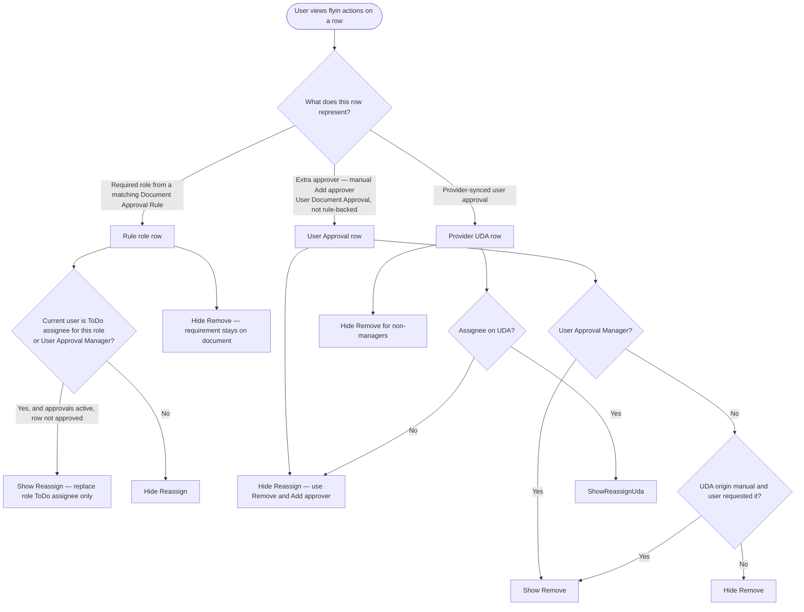

<!-- Copyright (c) 2026, AgriTheory and contributors
For license information, please see license.txt-->

# Usage

  Rohan Bansal, Cursor, fproldan, Ishwarya, Myuddin Khatri, Heather Kusmierz, and Tyler Matteson 2026-09-03

## Finding Documents That Need Approval

When someone saves a document that requires approval, the assigned approver knows through several channels:

- A ToDo appears in their ToDo list with a link to the document
- A notification may appear depending on notification settings
- If email reminders are configured, a daily email lists everything waiting
- A **Pending Approvals** icon in the desk navbar shows a badge count and opens a flyin drawer

Open the document to review it and take action.

The approval sidebar appears only on DocTypes configured with at least one enabled Document Approval Rule. Other forms are unchanged.

## Pending Approvals Drawer

The desk navbar includes a **Pending Approvals** flyin (requires the [Flyin](https://github.com/agritheory/flyin) app). Click the icon to open a queue of every open approval ToDo assigned to the current user.

The drawer uses **push mode**: when open, the main page content shifts left so the form and action buttons stay visible beside the queue instead of being covered.

### Review-First Flow

Each queue item shows the document type, name, assigned role, and how long it has been waiting.

- **Off-document:** only a **Review** button is shown. Clicking it navigates to the document form and keeps the drawer open.
- **On-document:** when the current route matches the queue item, the drawer shows **Role** and **Approval Rule** context, plus **Approve** and **Reject** buttons.
- Approve and Reject are enabled only when the current user can act on that document from the sidebar (same rules as the form approval panel).

After **Approve**, the item is removed from the queue immediately. The drawer waits two seconds, then navigates to the next pending document. After **Reject**, it advances to the next item right away.

### Deep Links from Notifications

Notification Log entries and reminder emails link directly into the review flow. A notification URL opens the document form, opens the Pending Approvals flyin, and selects the matching queue item.

Query parameters:

| Parameter | Purpose |
| :--- | :-------- |
| `flyin=pending-approvals` | Opens the Pending Approvals drawer |
| `approval_todo=TODO-00001` | Highlights the specific ToDo in the queue |

These parameters are stripped from the URL after the flyin opens so bookmarks and refreshes stay clean.

## Approving a Document

When a user opens a document awaiting their approval, an approval panel appears in the right sidebar. It shows each role or user that must approve, and whether they have done so.

Users with the required role see Approve and Reject buttons next to their approval.

To approve, review the document and click Approve.

The approval records immediately. If this was the last required approval, the document finalizes automatically. Submittable documents with a workflow apply the configured **Approval Action** (typically Approve), which submits the document and updates the workflow state. Non-submittable documents transition to the workflow's approved state. If other approvals are still pending, the document stays in its current state until everyone has approved.

On submittable documents **without a workflow**, the final approver sees a confirmation dialog before submit — **Permanently Submit {document name}?** — the same prompt ERPNext shows for a normal Submit action. Dismissing the dialog leaves the document in draft and does not record the approval.

Documents **with a workflow** do not show this dialog; the workflow handles state transitions when approvers act from the sidebar.

## Rejecting a Document

When something is wrong with a document, click Reject.

Depending on workflow settings, a reason explaining what needs to be fixed may be required. This comment is added to the document so the creator knows what to address.

Rejection does several things when a workflow is configured:

- Moves the document back to Draft through the workflow
- Clears all approvals that were already recorded (everyone needs to re-approve after changes)
- Notifies the document owner

When no workflow exists for the DocType, Reject does not change document status. Add a comment on the document or configure a workflow if you need structured reject-and-revise flows.

The owner can then edit the document and resubmit for approval.

## User Approvals (Add, Remove, Reassign)

When a document is open in the Pending Approvals flyin, **Add approver** is available while approvals are active on that document (draft, or in the workflow approval state when a workflow is configured). Document ownership and write permission are not used for this action. Each added approver becomes an extra requirement until they approve. The flyin shows who requested the approval and any reason that was entered.

**Remove** applies only to **extra** approvers added for a specific document (manual **Add approver** rows). It does **not** apply to requirements created by a **Document Approval Rule** that currently matches the document. Those rule-driven roles stay on the document until the rule no longer applies or an administrator changes configuration; use **Reassign** to change who acts for that role instead of removing the requirement.

Provider-assigned user approvals (`origin` from an approver provider hook) cannot be removed manually except by someone with the **User Approval Manager Role** from Document Approval Settings (default: System Manager). For removable manual rows, **Remove** is available to the person who requested that approver, or to the manager role.

**Reassign** is two different behaviors depending on row type:

- **Document Approval Rule role** (panel shows a role name): reassignment only changes **who holds the open approval ToDo** for that role (linked to the **Document Approval Rule**). The rule requirement stays; no **User Document Approval** row is created.
- **User Approval** row (panel shows a specific user from **Add approver**): only that named user may **Approve** or **Reject**. **Reassign** is not offered — change assignees with **Remove** and **Add approver** instead.

The user picker for **Reassign** lists only users who hold the same approval role (rule rows).

The added or reassigned user receives read and write access to the document when needed, a ToDo, and a notification. Changes are recorded on the document timeline, and affected users receive Notification Log entries.

### Flyin actions: **Reassign** vs **Remove**

The flyin exposes **Reassign** and **Remove** independently (`can_reassign` and `can_remove` from `fetch_approvals_and_roles`). They answer different questions: *who is assigned this approval?* versus *should this extra approver requirement exist at all?*

| Panel row | Source | **Reassign** | **Remove** |
| :--- | :--- | :--- | :--- |
| Role name (e.g. Accounts Manager) | Matching **Document Approval Rule** | Yes — current ToDo assignee or User Approval Manager, while approvals are active and the row is not approved | No — rule requirement is not removable from the document |
| Same role after **Reassign** | Open rule-linked ToDo for that role | Same as rule row (assignee may have changed) | No |
| **User Approval** (named user) | **Add approver** (`origin = manual`) | No — use Remove and Add approver | Yes — requester or User Approval Manager |
| User from provider | **approvals_approver_providers** | Per UDA assignee rules when the row is user-keyed | No, except User Approval Manager |

Implementation reference: `build_fetch_row_permissions` and `default_user_approval_permission` in `user_approvals.py` compute `can_reassign` and `can_remove`. **Remove** is always false for rule role rows (no `@` in the row key) and for any User Document Approval with `satisfies_role` set, including after **Reassign** on a Document Approval Rule role. The flyin binds buttons to those flags in `PendingApprovals.vue`.

## Understanding the Approval Panel

The sidebar panel shows the status of each required approval.

**With a workflow**, the panel is active while the document is in the workflow's Approval State. The form is read-only for editing during that state. After approval completes and the document moves to another state, normal editing resumes.

**Without a workflow**, the panel is active on draft documents (`docstatus = 0`) that match at least one rule. The form stays editable until the document is submitted. Approvers can act from the sidebar at any time while the document remains in draft.

Pending approvals show who the approval is assigned to. "You" means it is waiting on the current user.

Completed approvals show who approved, with a checkmark.

User approvals (those added for a specific document) appear with the user's name instead of a role name.

## How Assignment Works

When a document is saved, the system evaluates all matching rules and assigns approvers. For DocTypes with a workflow, assignment also requires the document to be in the workflow's Approval State.

If a rule has a specific Primary Assignee, that user always receives the assignment. Otherwise, the system rotates through users who have the required role, distributing work evenly over time.

The assigned user receives a ToDo. However, any user with the required role can approve. Assignment handles notification and tracking, not restriction.

## After All Approvals

Once every required approval is recorded:

- Submittable documents with a workflow apply the configured **Approval Action** workflow transition (typically Approve), which submits the document
- Non-submittable documents apply the workflow transition to the state marked **Approved State for Non-Submittable Document** and save
- The workflow state field and any configured state **Update Field** / **Update Value** settings are applied for both paths
- Submittable documents without a workflow still submit directly after the approver confirms in the submit dialog

On submittable documents without a workflow, the last approver confirms submit in a dialog before the document posts.

No manual **Submit** click is needed after the last sidebar approval when auto-submit applies.
